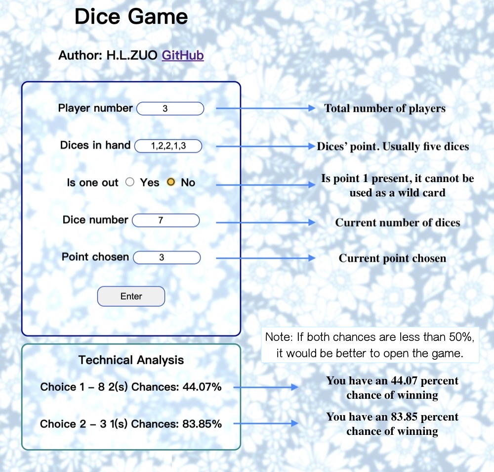
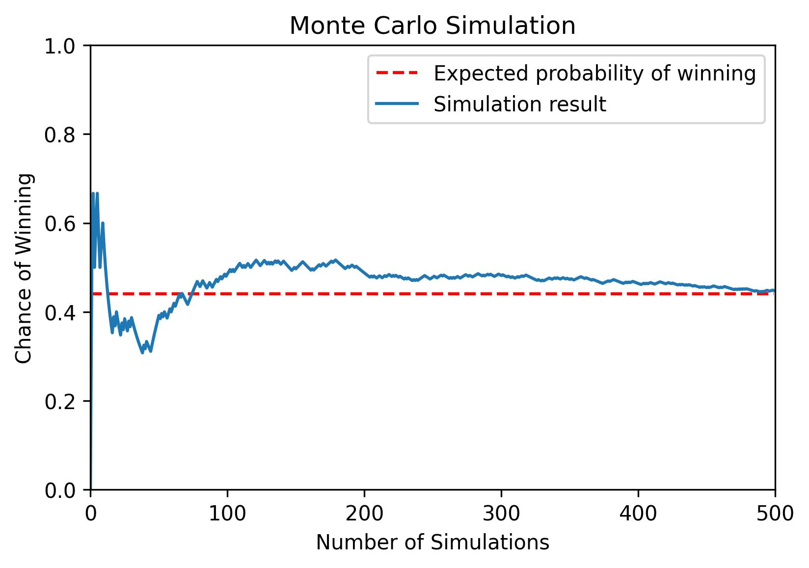

# Dice Game

## Guidance

## Deployment

The applet is deployed to heroku: [https://dice-game-zhl.herokuapp.com/](https://dice-game-zhl.herokuapp.com/ "open app")

## Game Rules (Chinese version)

游戏规则描述：N个人围成一圈一起摇骰子，每人5个骰子。每个人只能查看自己的结果。轮流报数，第m个人的格式为“ $k_m$ 个 $i$ ”。其中 $i$ 为骰子点数（1~6）。下家可以选择继续报数或者开牌。
若继续报数， $k_m+1$ 一定要比 $k_m$ 大， $i$ 可以不相同。
若选择开牌，则统计所有人的结果中 $i$ 的个数，若大于 $k_m$ 则开牌者输掉，否则其上家输掉。
第一个玩家报数 $k_1$ 不能少于N，1是万能牌，可以作为任意点数。但若有人已经报了1，则1只能当作1使用。

例子：两个人一起玩

甲：我觉得有3个6

乙：我认为有4个6

甲：我认为有7个3

乙：我不信，开

场上结果：甲乙两人10个骰子中共有4个3，2个1，这样算作6个3。因此甲说的过多，甲输掉游戏。

## Game Rules (English version)

Description of the game rules: N people form a circle and roll the dice together, each with 5 dice. Each person can only view their own results. Take turns to report the number, the format of the mth person is " $k_m$ $i$ (s)". Where $i$ is the number of dice (1~6). The next home can choose to continue to report the number or open the card.
If you continue to count, $k_m+1$ must be larger than $k_m$, and $i$ can be different.
If you choose to open the card, count the number of $i$ in everyone's results. If it is greater than $k_m$, the opener loses, otherwise the upper player loses.
The first player to report $k_1$ must not be less than N, 1 is a wild card and can be used as any point. But if someone has already reported 1, then 1 can only be used as 1.

Example: two people playing together

A: I think there are 3 6s

B: I think there are 4 6s

A: I think there are 7 3s

B: I don't believe it, open

Results on the field: A and B have 4 3s and 2 1s out of the 10 dice, which is counted as 6 3s. Therefore, A says too much, and A loses the game.

# Statistical model

## Binomial Distribution

### Probability mass function

### Cumulative distribution function (CDF)

## Validation

Monte Carlo simulation method is used to validate the result.

